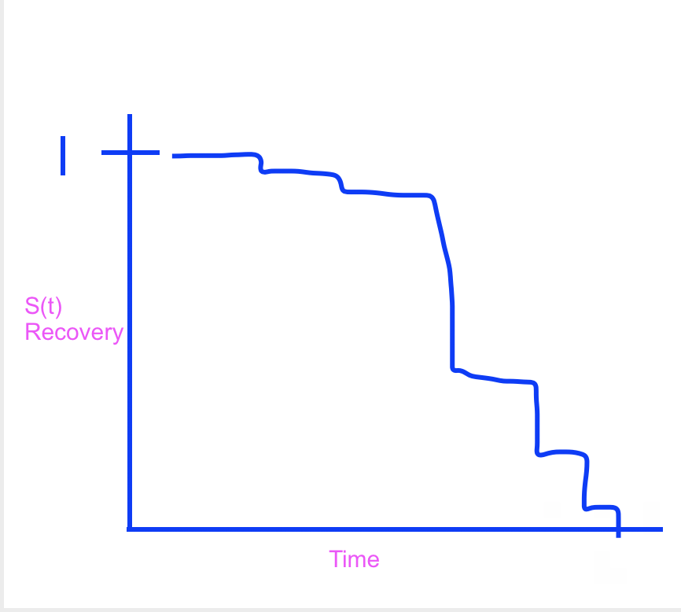
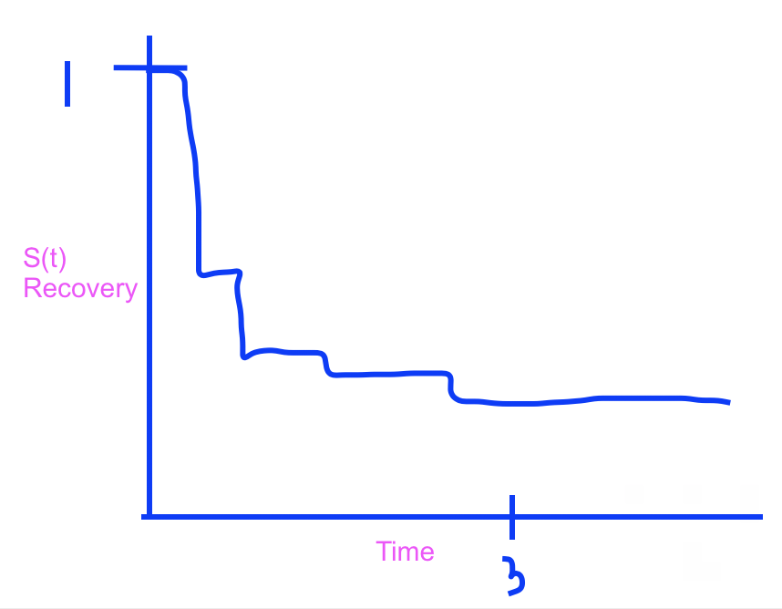
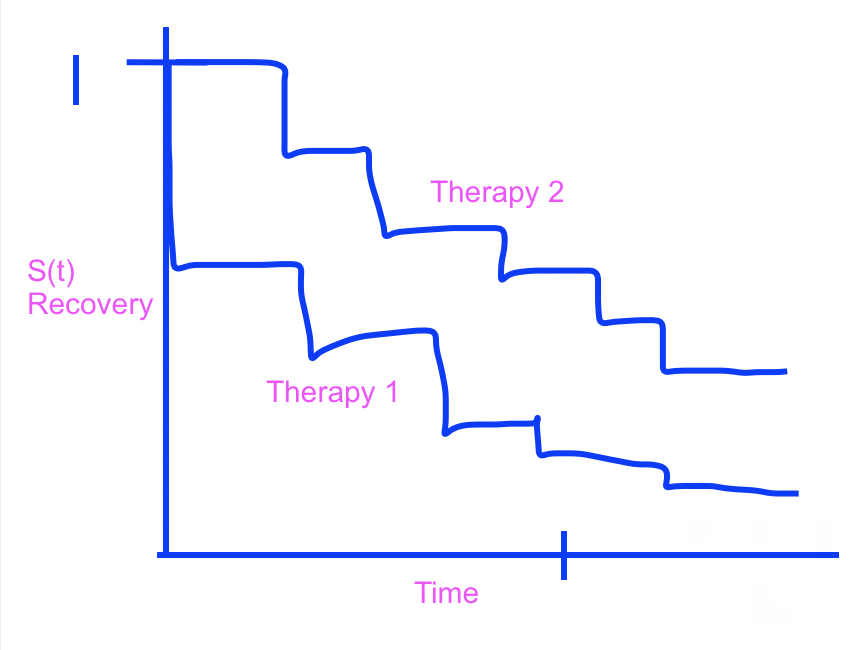
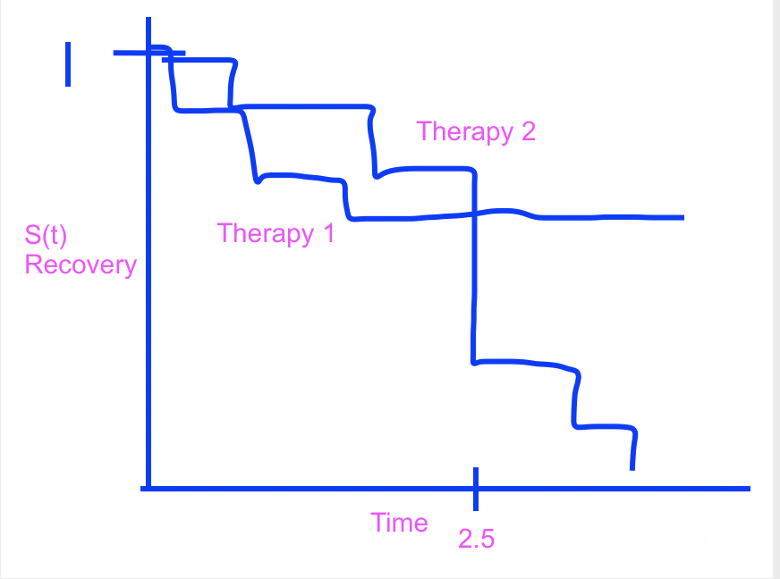

```{r global_options, include=FALSE, message=FALSE, warning=FALSE}
knitr::opts_chunk$set(message=FALSE, warning=FALSE, fig.height=3, fig.width=5, 
                      fig.align = "center")
library(tidyverse)
library(broom)
library(survival)
library(survminer)
library(praise)
```


### Assignment Summary (Goals)
* understanding of what a KM curve measures
* using R to plot KM curves and CIs
* considering KM curves separately for a categorical explanatory variable
* testing the null hypothesis of equality of S(t) across an explanatory variable

Note that if you don't know the R code either check my notes or ask me!!!  Happy to scaffold, debug, send resources, etc.  Don't go down a rabbit hole trying to figure out an R function or syntax.

## Important

I put all the datasets into the Box folder (linked from Sakai), the same one which also contains the course videos.  I'm hoping that having the data in Box will be easier than having it in Sakai.  Note the odd format to the URL below.  `/shared/static/...csv`.  You should be able to read in any of the datasets using that format.  In terms of this week's HW, the code I've written should read it the data just fine for you.

Make sure you have the **survival** (for the survival estimates) and the **survminer** (for the plots) packages installed.

#### Q1. PodQ
Describe one thing you learned from someone in your pod this week (it could be: content, logistical help, background material, R information, etc.)  1-3 sentences.

Annika is auditioning for her first broadway show!!! The lead in the Phantom of the Opera!

Today is Lian's one year anniversary with her baeeeee

#### Q2.  Chp 9, A26

Provide a brief explanation of why the estimated variance of $\hat{S}_{KM}(0)$, and hence the standard error of $\hat{S}_{KM}(0)$, is equal to 0.

Note that $\hat{S}_{KM}(0)$ is the estimated probability of surviving after time 0. In every survival analysis, all the subjects should be alive at the start of the study, $T=0$ (it would be silly/innapropriate to include people who already died in your analysis). Therefore, for every survival analysis, the probability of surviving until after $T=0$ should be 1. Since $\hat{S}_{KM}(0)=1$ always, it has variability (i.e. variance, sd) of 0. 

#### Q3. Chp 9, E4

Immediately after a heart transplant, patients are randomly assigned to two treatment therapies to improve recovery from the transplant, therapy 1 and therapy 2.  The patients are then followed for up to 5 years after their surgery.  Define the time-to-event random variable T as the time (in months) until recovery (the event) after a heart transplant.  For each of the following study descriptions that involve T, sketch the graph of the survival curve (or curves) with as much detail as necessary.  Please note that parts (a) through (d) are completely independent of each other.

(a) Therapy 1 is not very effective shortly after surgery, but everybody recovers before the study period is over.  

{width=40%}

(b) Therapy 2 is very effective shortly after surgery, but becomes less effective after 3 years.  Not every patient fully recovers by the end of the study period.  

{width=40%}

(c) Two curves on the same plot:  Therapy 1 is consistently more effective than Therapy 2 over time.  

{width=40%}

Note that therapy 1 curve starts at (0,1) I swear!!

(d) Two curves on the same plot:  Therapy 1 is more effective than Therapy 2 for the first 2.5 years, and then Therapy 2 is more effective than Therapy 1 for the remaining duration of the study.  

{width=40%}

#### Q4. Chp 9, E6

The Kaplan-Meier curve in Figure 9.17 (see the text, on Sakai) displays hypothetical estimated survival probabilities of death due to brain cancer, where time (from diagnosis) until death is measured in months.

(a) Is the largest event time censored or complete?  How do you know?  

The largest event time is complete because everyone died (i.e. survival probability reached 0 so everyone in the study died).

(b) Use the curve to estimate the mean time until death due to brain cancer.  [Read page 295 in the text.]

The estimated mean survival time is:
\[
\hat{\mu}=\hat{S}(t_0)_{KM}(t_1-t_0)+\hat{S}(t_1)_{KM}(t_2-t_1)+ \ldots+ \hat{S}(t_m)_{KM}(t_m-t_{m-1})
\]
Which yields:
\[
\hat{\mu}=10 \cdot 1 + 30 \cdot 0.85 + 75 \cdot 0.65 + 30 \cdot 0.45 + 155 \cdot 0.2=\boxed{128.75}
\]
This is my estimate of the average survival time.

#### Q5. Chp 9, E11 Male Fruit Fly Longevity

(Lots to read in the text about the dataset.)

(a) Construct the Kaplan-Meier curve with a confidence interval for the `Fruitfly` data and describe the survival pattern for the fruitflies over time.  Use `Longevity` as the time-to-event variable.

```{r}
fruitfly <- read_csv("https://pomona.box.com/shared/static/qnsl0sp0twdutz6azidxb5yt37boee7v",
                     na="*")

fly_surv <- survfit(Surv(Longevity, Censor) ~ 1, data=fruitfly)

ggsurvplot(fly_surv, conf.type = "log") + ggtitle("Fly Survival")
```

Look at the online notes example (http://st47s.com/Math150/Notes/survival-analysis.html#Rsurv) for how to implement the R code, but the basics of what you need are below.  Look up `?ggsurvplot` (in the **survival** package) to see the different confidence interval types.

Notice that the "response variable" is now **two** variables!!!  And we put them together with the `Surv()` function  The `Surv()` function takes two arguments.  The first argument is the time variable.  The second argument is the censoring information.  You shouldn't have to transform any of the variables in the dataset which is provided.

(b) Construct the Kaplan-Meier curve for the lifetimes of the fruitflies by number of partners, using `Partners` as the grouping variable.  Briefly comment on the observed relationship between survival and number of female partners.

The R code will be very similar to part (a), but model the survival response variable as a function of the explanatory variable `Partners`.

```{r}
fly_surv <- survfit(Surv(Longevity, Censor) ~ Partners, data=fruitfly)

ggsurvplot(fly_surv, conf.type = "log") + ggtitle("Fly Survival")
```

It looks like flies with a lot of partners (particularly 8 partners) die off sooner than flies with no partners. 

(c) Perform the log-rank and Wilcoxon tests.  Report the test statistics and p-values for both tests.  State the conclusions for both tests.  If the tests yield different conclusions, briefly explain why.  [We will cover these tests on Monday in class.]

The R function which runs the two tests is called `survdiff()`.  It acts on the `Surv()` response variable broken down by the explanatory variable, `Partners`.  

The argument "rho = ___ " controls which test you'd like to run.  "rho = 0" gives the log-rank test.  "rho = 1" gives the Wilcoxon test.  Try typing `?survdiff` to see the help file.

```{r}
survdiff(Surv(Longevity, Censor) ~ Partners, data= fruitfly, rho=0)
survdiff(Surv(Longevity, Censor) ~ Partners, data= fruitfly, rho=1)
```

The log rank test generates a test statistic of 7.2 and a p-value of 0.03.
The Wilcoxon test generates a test statistic of 10.8 and a p-value of 0.005.
Both tests show that survival at at least one time point is significantly different between flies with different numbers of lovers.

```{r}
praise()
```


