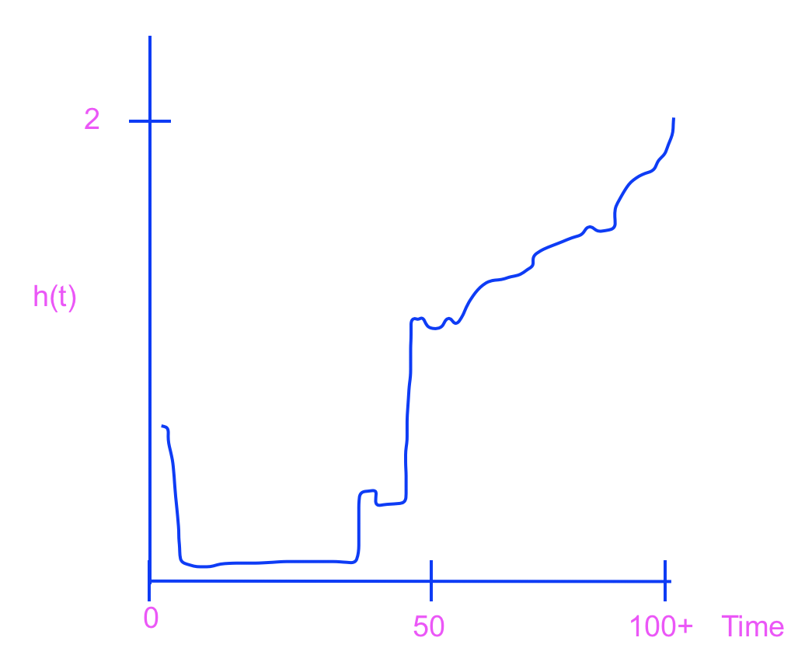
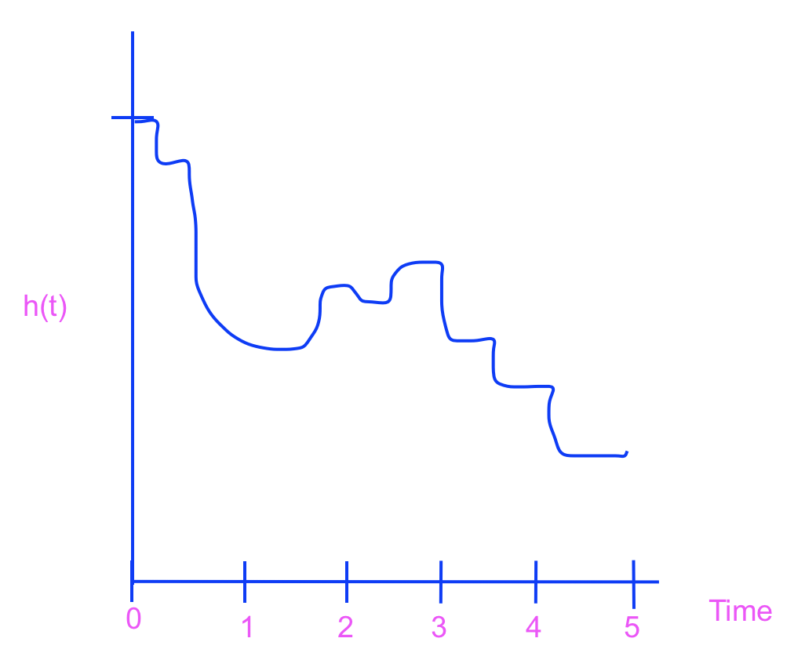
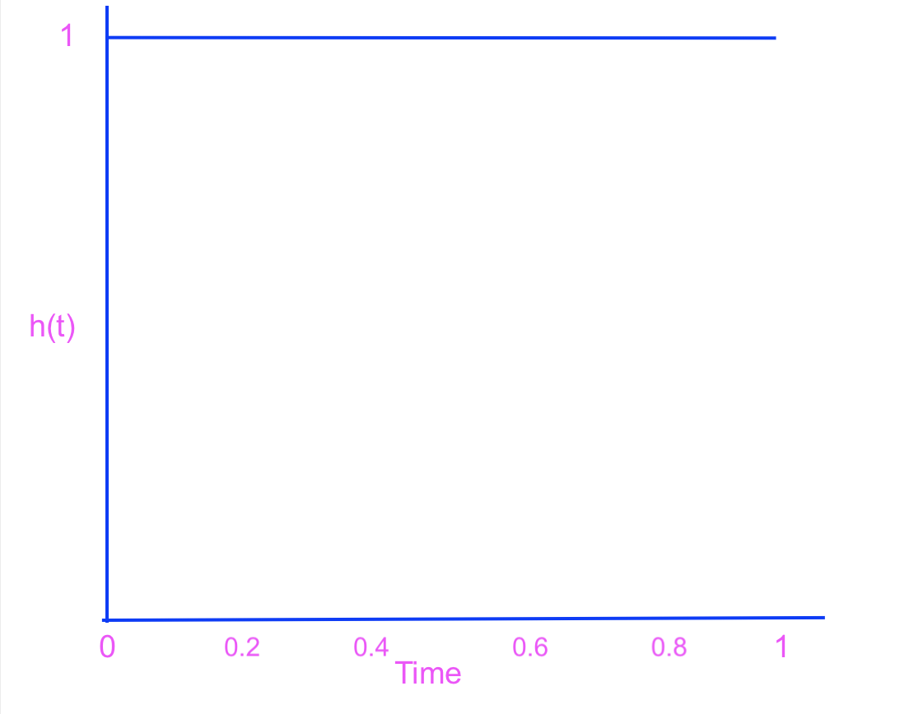
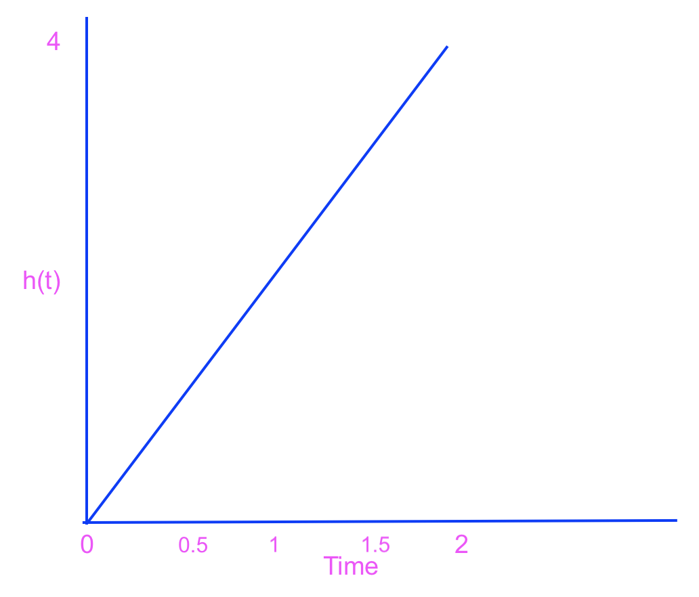
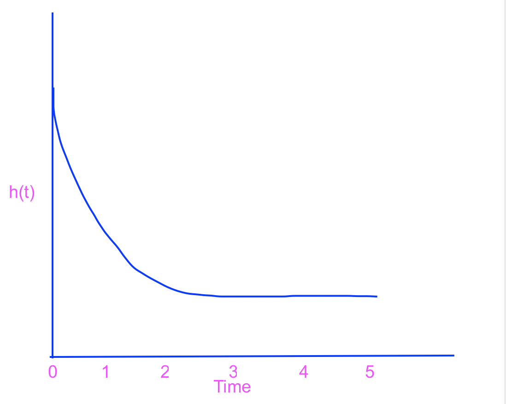

```{r global_options, include=FALSE, message=FALSE, warning=FALSE}
knitr::opts_chunk$set(message=FALSE, warning=FALSE, fig.height=3, fig.width=5, 
                      fig.align = "center")
library(tidyverse)
library(broom)
library(survival)
library(survminer)
library(praise)
```


### Assignment Summary (Goals)
* working with hazard functions as measures of survival (S(t) and h(t) are functions of each other!)
* working with cumulative hazard functions


## Important

All the datasets are in the Box folder (linked from Sakai), the same one which also contains the course videos. The data in Box may be easier to work with than the data in Sakai.  Note the odd format to the URL below.  `/shared/static/...csv`.  You should be able to read in any of the datasets using that format.  In terms of this week's HW, the code I've written should read in the data autmoatically.

(Apropos of nothing, I find the following website to be very helpful in making markdown tables:  https://www.tablesgenerator.com/markdown_tables)


#### Q1. PodQ
Describe one thing you learned from someone in your pod this week (it could be: content, logistical help, background material, R information, etc.)  1-3 sentences.

Lian is mean! Also, Lian's cartoon crush is Spirit, The Stallion of the Simmeron.
Annie is turning in her thesis and getting jabbed (vaxxed) tomorrow! Annie's cartoon crush is Jimmy Neutron.
Annika has been playing a lot of volleyball lately! Annika's cartoon crush is the prince from thumbalina.

#### Q2. Chp 9, E12  VA Lung Cancer Study

(Lots to read in the text about the dataset.)

```{r message=FALSE, warning=FALSE}
VAlung <- read_csv("https://pomona.box.com/shared/static/r6hoo1gawopkt0526xvwwze5fl3245de",
                     na="*") %>%
  mutate(karno2 = ifelse(karno <= 60, "low", "high"))
```

(a) Create a graph with both Kaplan-Meier curves to compare the survival time (use the variable `time`) for subjects with the standard and the test chemotherapy treatment.  What do you observe about the survival probabilities for the groups of subjects?

```{r}
p1.surv <- survfit(Surv(time,status) ~ trt, data=VAlung)

survminer::ggsurvplot(p1.surv, conf.int=F, censor=F) + ggtitle("Surv curves")
```
Survival probabilities for the treat=1 (standard) appear slightly higher initially, but then the survival curves appear to be the same after approximately 200 days onward. So the chemotherapy treatment doesn't seem to providing much of a survival advantage.

(b) Conduct the log-rank test and the Wilcoxon test to compare the survival curves of both treatment groups.  Interpret the results.

```{r}
survdiff(Surv(time,status) ~ trt, data=VAlung, rho=0)
survdiff(Surv(time,status) ~ trt, data=VAlung, rho=1)
```
The Log-Rank test and the Wilcoxon test yield nonsignificant p-values (0.9 and 0.4) respectively, illustrating that we cannot reject the null hypothesis that the survival probabilities are the same for the two treatment groups at every time point.

(c) It may be beneficial to incorporate health as a variable in the analysis.  Patients with low Karnofsky scores are less healthy than patients with high Karnofsky scores.  Create four groups with the `Veteran` data: `trt=1` and Karnofsky score low, `trt=1` and Karnofsky score high, `trt=2` and Karnofsky score low, and `trt=2` and Karnofsky score high.  Recall that it is often best to keep sample sizes as equivalent as possible when you determine what is a low or high Karnofsky score.  Create a Kaplan-Meier curve for each of the four groups.  Conduct the log-rank test and the Wilcoxon test to compare the survival curves of the four groups.  (While we have only discussed using these tests to compare two groups, they can easily be extended to more than two groups. Did incorporating health into your analysis impact your conclusions?  [The R syntax works like other modeling we have done, just add the explanatory variables after the tilde:  `~ trt + karno2`.]

```{r}
p1c.surv <- survfit(Surv(time,status) ~ trt+karno2, data=VAlung)
survminer::ggsurvplot(p1c.surv, conf.int=F, censor=F) + ggtitle("Surv curves")

survdiff(Surv(time,status) ~ trt+karno2, data=VAlung, rho=0)
survdiff(Surv(time,status) ~ trt+karno2, data=VAlung, rho=1)
```
Incorporating health did impact my conclusion! The wilcoxon and log rank tests both generate significant p-values, illustrating that survival is different between the groups for at least one time point. The chemotherapy group (trt=2) with health individuals (high karnovsky scores) has the highest survival, followed by the standard treatment with healthy individuals, followed by the standard treatment with unhealthy individuals, followed by chemo treatment with unhealthy individuals.
Thus chemo is effective for significantly increasing survival in healthy individuals.

#### Q3. Chp 9, A45

I've included the R code to create a hazard curve (the R code came with your text book and is on Sakai).  Note, however, as discussed, the hazard rate is extremely sensitive to each time interval.  In lieu of looking at the hazard curve, it is often more informative to look at the cumulative hazard curve (see section 9.9).  The values of the estimated hazard function can be seen in the cumulative hazard curve as the jumps at each time event.

You may use the code below (the function, below, is called `plot.haz()` ) or you can use the code (see R code in the class notes, set `fun="cumhaz"`) to plot the cumulative hazard function using `ggsurvplot()`.

Use the software instructions provided to plot the estimated hazard rates for the college graduation data (see page 311).

```{r}
plot.haz <- function(KM.obj,plot="TRUE") {
  ti <- summary(KM.obj)$time
  di <- summary(KM.obj)$n.event
  ni <- summary(KM.obj)$n.risk

  #Est Hazard Function
  est.haz <- 1:(length(ti))
  for (i in 1:(length(ti)-1))
    est.haz[i] <- di[i]/(ni[i]*(ti[i+1]-ti[i]))
  est.haz[length(ti)] <- est.haz[length(ti)-1]

  if (plot=="TRUE") {
    plot(ti,est.haz,type="s",xlab="Time", ylab="Hazard Rate",
         main=expression(paste(hat(h),(t)[KM])))
    }
  #return(list(est.haz=est.haz,time=ti))
}
```

```{r message=FALSE, warning=FALSE}
grad <- read_csv("https://pomona.box.com/shared/static/yigpp4e8dvkyw9pf3f0c7o9nr0rt3k6m", na="*")
```

```{r}
p3.surv <- survfit(Surv(Years,Censor) ~ 1, data=grad)

plot.haz(p3.surv)
```

#### Q4. Chp 9, A46 

Although the estimated hazard curve may not exhibit a distinguishable pattern, discuss some important features of the curve (see pg 311).

The hazard (risk) of graduating college is really low early on (2-3 years), then fluctuates semi regularly (period of approx. 0.5 year) between 4 and 8 years. Overall, as time goes on, the amplitude of the peaks decreases, suggesting that risk of graduating generally decreases over time.

#### Q5. Chp 9, A47

Indicate periods of time during their college career when students are at their lowest and highest risk of graduating college.  Does your answer match your common understanding of when students typically graduate from college?  (see pg 311)

The hazard of graduating is highest slightly before 4 years, which means that the highest risk of graduating is a little before 4 years. Then there are other hazard peaks slightly before 5 years, 5.5 years, and 6 years, indicating that there's elevated risks of graduation at these times.
The hazard of graduating is lowest over 2-3 years, right after years 4,4.5,5.5, 6, 6.5. Essentially, graduation risk is lowest after the completion of semesters and in the earlier years (years 2 and 3) of college.

#### Q6. Chp 9, E9

Sketch hazard functions that would correspond to the following time-to-event random variables (You may want to do a little background research.)

(a) Lifetime of an individual measured from birth (don't assume anything about the health or demographics of this person).

{width=30%}

There's a higher hazard immediately after birth (due to birth defects, SIDs, etc), then a period of lower hazard (death risk) from teenage years to beginning of middle age (when most are healthy). Then hazard (death risk) increases sharply at middle age (as this is when serious health issues begin to crop up) and climbs steeply throughout old age.

(b) Time until death after surgery to remove a cancerous tumor.

{width=30%}

There's a higher hazard immediately after the surgery (perhaps the cancer wasn't fully resected, infection, etc.). Then there's a latency period where the hazard drops. Then there's an increase in hazard where patients are subject to potential recurrence. Then at the 4 and 5 year mark, hazard drops as patients enter remission.

Be sure to label the time axis, and mark time points appropriately.  Briefly explain your reasons for any changes in the shape of the hazard function over time.

#### Q7. Chp 9, E10 

The graphs displayed in Figure 9.19 (see pg 325) are population cumulative hazard functions for three distributions of the time-to-event random variable, T.For each one, sketch a possible corresponding hazard function h(t).  Be sure to label the same time points on your sketches as are provided on the graphs of H(t).

{width=30%}

{width=30%}

{width=30%}

```{r}
praise()
```

